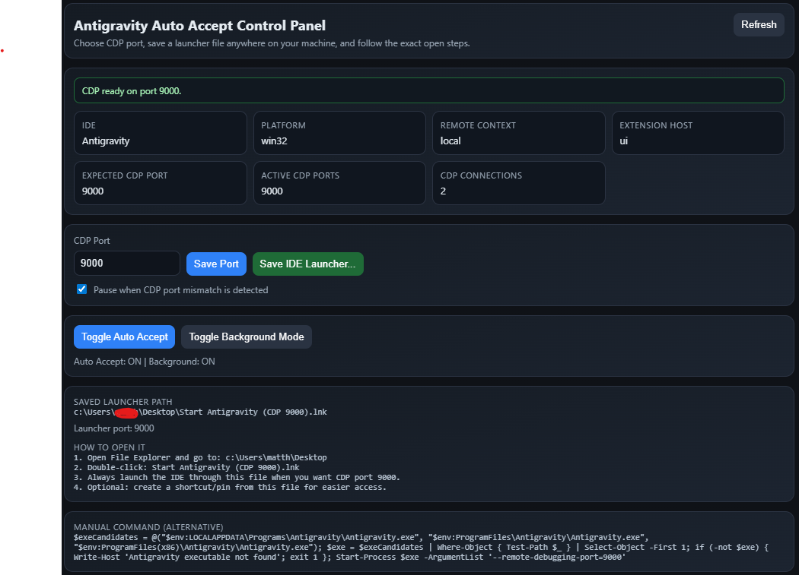

# Antigravity Auto Accept

This extension is free. I have spent a lot of time building it, maintaining it, and fixing it again after upstream changes and updates. If it saves you time, please take a minute to rate it on Open VSX:

https://open-vsx.org/extension/pesosz/antigravity-auto-accept/

That helps a lot.



Antigravity Auto Accept removes repetitive approval clicks in Antigravity and gives you a clear control panel for CDP status, launcher generation, and runtime control.

## What It Does

- Auto-accepts common Antigravity approval actions.
- Shows the current CDP state in a dedicated control panel.
- Lets users choose the CDP port instead of hard-coding one path.
- Saves a launcher file anywhere on the machine.
- Provides exact open steps plus a manual fallback command.
- Supports background mode when CDP is available.

## How It Works

1. The extension runs locally in the UI extension host.
2. It tracks the current IDE, platform, expected CDP port, active CDP ports, and live CDP connections.
3. The user opens the control panel and chooses the desired CDP port.
4. The user saves a platform-specific launcher file.
5. That launcher starts the IDE with `--remote-debugging-port=<port>`.
6. Once CDP is active, the extension can handle approvals more reliably and expose a cleaner runtime state.

## Control Panel

The control panel is the center of the current workflow.

It shows:

- IDE
- platform
- remote context
- extension host
- expected CDP port
- active CDP ports
- active CDP connections
- saved launcher path
- exact manual launch command

It also lets the user:

- save the selected CDP port
- save an IDE launcher anywhere
- toggle Auto Accept
- toggle Background Mode
- pause behavior on CDP mismatch

## Launcher Flow

The launcher flow replaced the older disruptive setup path.

The current behavior is:

1. Choose a CDP port in the control panel.
2. Click `Save IDE Launcher...`.
3. Save the file wherever you want.
4. Open the IDE through that saved file whenever you want the selected CDP port.

Generated launcher format by platform:

- Windows: `.lnk`
- macOS: `.command`
- Linux: `.sh`

The panel also shows:

- the saved launcher path
- step-by-step open instructions
- a manual fallback command if you want to launch it yourself

## What Changed In This Fix Cycle

- Replaced noisy startup setup prompting with a dedicated control panel flow.
- Added a persistent bottom-right status entry for opening the panel.
- Added configurable CDP port management.
- Replaced desktop-only assumptions with a save-anywhere launcher flow.
- Simplified the panel so it focuses on the actions users actually need.
- Improved runtime status reporting for expected port, active ports, and connections.
- Added clearer manual instructions directly in the UI.
- Fixed Windows launcher generation so it follows the working shortcut shape already used by Antigravity on this machine.
- Reduced prompt flooding and mismatched setup states.

## Platform Status

Current factual status:

- Windows: validated in the current fix cycle.
- macOS: launcher generation is implemented with `.command` output.
- Linux: launcher generation is implemented with `.sh` output.

Windows has been verified end-to-end in the current fix cycle. The macOS and Linux launcher paths are implemented in the extension and documented, but they should still be validated on native hosts before calling them equally proven in every environment.

## Quick Start

1. Install the extension from Open VSX or from a VSIX.
2. Open `Antigravity Auto Accept: Open Control Panel`.
3. Set the CDP port you want.
4. Click `Save IDE Launcher...`.
5. Save the launcher wherever you want on your machine.
6. Open Antigravity through that saved launcher.
7. Turn on `Auto Accept`.

## Commands

- `Antigravity Auto Accept: Toggle ON/OFF`
- `Antigravity Auto Accept: Toggle Background Mode`
- `Antigravity Auto Accept: Save IDE Launcher`
- `Antigravity Auto Accept: Open Control Panel`

## Manual Fallback Commands

### Windows

```powershell
$exeCandidates = @(
  "$env:LOCALAPPDATA\Programs\Antigravity\Antigravity.exe",
  "$env:ProgramFiles\Antigravity\Antigravity.exe",
  "$env:ProgramFiles(x86)\Antigravity\Antigravity.exe"
)
$exe = $exeCandidates | Where-Object { Test-Path $_ } | Select-Object -First 1
if (-not $exe) { Write-Host 'Antigravity executable not found'; exit 1 }
Start-Process $exe -ArgumentList '--remote-debugging-port=9000'
```

### macOS

```bash
open -n -a Antigravity --args --remote-debugging-port=9000
```

### Linux

```bash
antigravity --remote-debugging-port=9000 >/dev/null 2>&1 &
```

## Install Options

- Open VSX:
  https://open-vsx.org/extension/pesosz/antigravity-auto-accept/
- GitHub releases:
  https://github.com/pesoszpesosz/antigravity-auto-accept/releases

## Additional Docs

- [INSTALL.md](./INSTALL.md)
- [USER_MANUAL.md](./USER_MANUAL.md)
- [WORKING_SETUP.md](./WORKING_SETUP.md)
